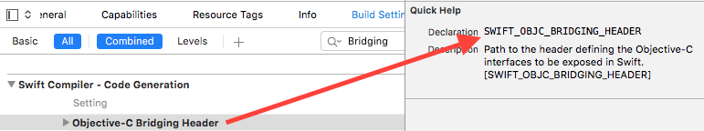

Ambient environment for Xcode projects
======================================

Ambient lets you define all of your xcode project environment settings all in one easy to read Ruby file, and re-apply it to your Xcode project to ensure settings are correct.

An `xcconfig` file can be used in order to help abstract your settings away from the main project file. The disadvantage of `xcconfig` files though is that they can still be overridden by settings defined in the project. Ambient doesn't have this issue as it simply overwrites the values in the project file.

Installation
============

Simply run:
```
gem install ambient-xcode
```

Or if you use Bundler, add the following to your `Gemfile`:
```
gem "ambient-xcode"
```

Usage
=====

Create an `Ambientfile` defining your project in the same directory as your `*.xcodeproj` file.

Here's a sample of the `Ambientfile` structure:
```ruby
enable_default_warnings!
use_defaults_for_everything_not_specified_in_this_file!

option "IPHONEOS_DEPLOYMENT_TARGET", "7.0"
option "SDKROOT", "iphoneos"
option "CLANG_ENABLE_OBJC_ARC", true
option "CLANG_ENABLE_MODULES", true

target "MyProject" do
  capability :healthkit
  capability :apple_pay

  scheme "Debug" do
    option "PRODUCT_NAME", "Debug"
    option "BUNDLE_DISPLAY_NAME_SUFFIX", "uk.danielgreen.MyProject"
  end
end
```

Name of the constant that can be used as an option is located in the **Quick Settings**


Run `ambient` from the command line to write your settings into your project.

The [example Ambientfile](https://github.com/Dan2552/ambient-xcode/blob/master/example/Ambientfile) or [example Ambientfile-swift](https://github.com/Dan2552/ambient-xcode/blob/master/example/Ambientfile-swift) matches the exact settings of a new iOS project.

If for any reason you want multiple Ambientfile (maybe for example if you wanted different capabilities for an Enterprise build vs an AppStore build), you can:
```
use_settings_from 'Ambientfile' # inherits all of the settings from Ambientfile

target "Monies" do
  development_team "341MONEY25"
  capability :apple_pay
end
```

Just run `ambient [filename]` (e.g. `ambient Ambientfile-enterprise`)

Notes
=====

- Use the `use_defaults_for_everything_not_specified_in_this_file!` setting to ensure your project file is clean. Warning though: this setting will clear all your targets' settings, so be sure to define absolutely every setting in the `Ambientfile` if you want to use this.
- When defining settings directly within a target, the setting is set to each scheme.


Possible future features
========================

- Automatic editing of `.entitlements`
- Helper method to change build phases to default
- Version number + build number
- Provisioning profiles from searching by name rather than storing a uuid (so it actually works across teams)
- `Info.plist` definitions
- ?
- Ability to not have to commit `*.xcodeproj` into version control (maybe too far?)
